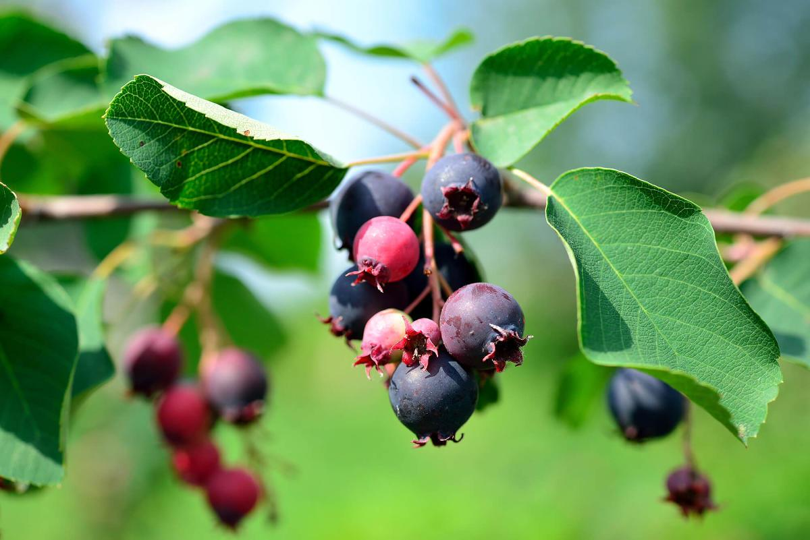

# Welcome!

  

<i> Conservation of Canadian Crop Wild Relatives (CWR) </i> is an app tool that will enable you to explore the diversity of CWR and WUS in Canada. 

This tool was designed to accompany a national inventory and conservation assessment of Canada's CWR and WUS diversity, [published here]()

  

You can access our inventory of Canadian CWR and WUS 
[here](https://github.com/jensculrich/Canadian_CWR_inventory_and_conservation/blob/main/Input_Data_and_Files/inventory.csv).

This app has been made with [shiny](https://shiny.rstudio.com/) and you may
find the code on [github](https://github.com/jensculrich/cwr_shiny_app).

